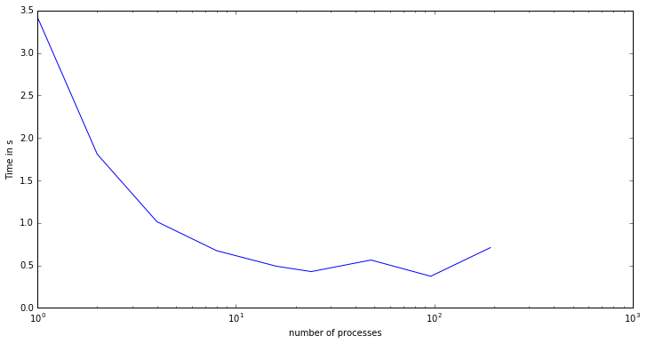
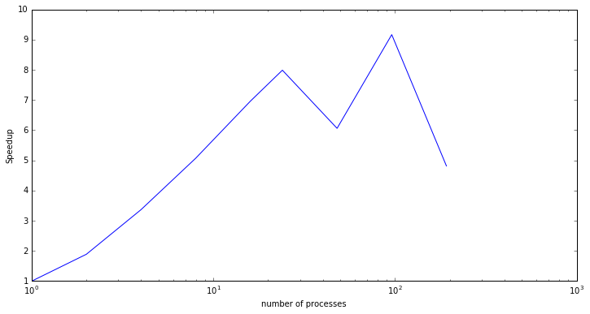
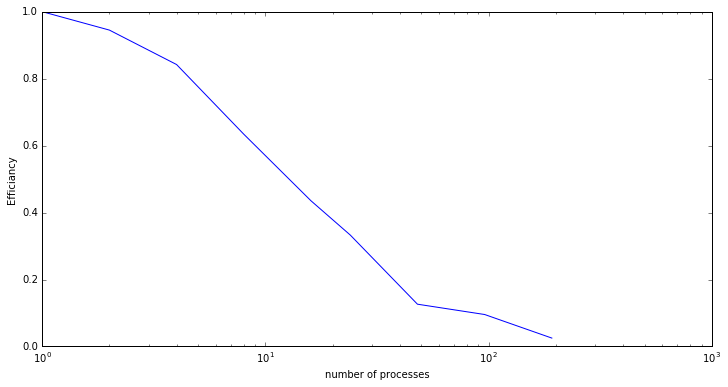
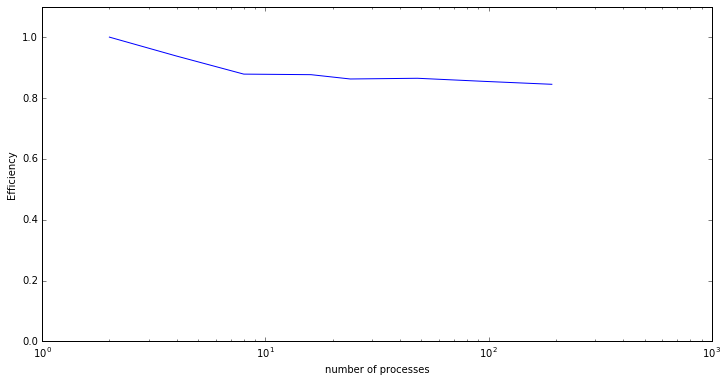

```python
import numpy as np
import matplotlib.pyplot as plt
```

### Band calculation with 100 Atoms in UC. 900 k-points


```python
nProcs = np.array([1,      2,     4,     8,     16,    24,    48,    96,      192])
time = np.array(   [3.419, 1.809, 1.015, 0.674, 0.491, 0.428, 0.564, 0.373  , 0.71])
fig, ax = plt.subplots(figsize=(12, 6))
ax.semilogx(nProcs, time)
ax.set_xlabel("number of processes")
ax.set_ylabel("Time in s")
plt.show()
```





```python
speedup = time[0]/time
fig, ax = plt.subplots(figsize=(12, 6))
ax.semilogx(nProcs, speedup)
ax.set_xlabel("number of processes")
ax.set_ylabel("Speedup")
plt.show()
```





```python
eff = time[0]/(nProcs * time)
fig, ax = plt.subplots(figsize=(12, 6))
ax.semilogx(nProcs, eff)
ax.set_xlabel("number of processes")
ax.set_ylabel("Efficiancy")
plt.show()
```





### DOS calc 100 Atoms  $100^2$ kpts


```python
nProcs = np.array([2,          4,       8,      16,     24,      48,      96,      192])
time = np.array([6966.581,  3714.646, 1982.701, 993.41, 673.161, 335.669, 169.844, 85.883])
fig, ax = plt.subplots(figsize=(12, 6))
ax.semilogx(nProcs, time)
ax.set_xlabel("number of processes")
ax.set_ylabel("Time in s")
plt.show()
```


```python
speedup = time[0]/time
fig, ax = plt.subplots(figsize=(12, 6))
ax.loglog(nProcs, speedup)
ax.set_xlabel("number of processes")
ax.set_ylabel("Speedup")
plt.show()
```


```python
eff = nProcs[0]*time[0]/(nProcs * time)
fig, ax = plt.subplots(figsize=(12, 6))
ax.semilogx(nProcs, eff)
ax.set_xlabel("number of processes")
ax.set_ylabel("Efficiency")
ax.set_ylim([0.0,1.1])
plt.show()
```





```python

```
